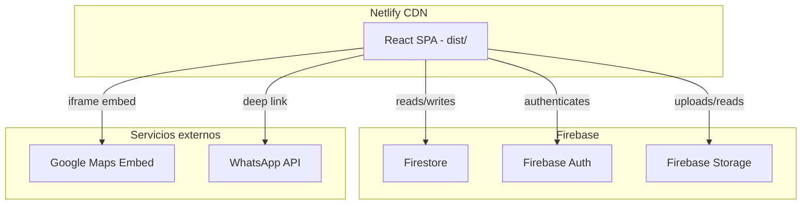
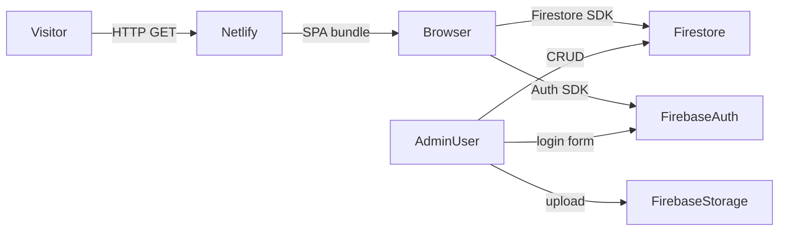

# Design Document

## F&G Reparación y Ventas — Website

---

## Overview

Sitio web profesional para **F&G Reparación y Ventas**, construido como una Single Page Application (SPA) con React + Vite. Combina un frontend público orientado a conversión con un panel de administración privado. El stack es completamente serverless: Firebase Firestore como base de datos, Firebase Auth para autenticación, Firebase Storage para imágenes, y Netlify como plataforma de despliegue.

### Stack tecnológico

| Capa | Tecnología |
|---|---|
| Framework UI | React 18 + TypeScript |
| Build tool | Vite 5 |
| Routing | React Router DOM v6 |
| Estilos | Tailwind CSS v3 |
| Animaciones | Framer Motion v11 |
| i18n | i18next + react-i18next |
| Backend / DB | Firebase Firestore |
| Auth | Firebase Auth (email/password) |
| Storage | Firebase Storage |
| Despliegue | Netlify |

### Paleta de colores

| Token | Valor | Uso |
|---|---|---|
| `primary` | `#E85D26` (coral) | CTAs, acentos |
| `dark` | `#0F172A` | Fondos oscuros, sección "¿Por qué?" |
| `light` | `#F8FAFC` | Fondos claros |
| `text` | `#1E293B` | Texto principal |

---

## Architecture

La aplicación sigue una arquitectura de capas con separación clara entre UI, lógica de negocio y acceso a datos.



### Flujo de datos



### Estructura de directorios

```
src/
├── assets/              # Imágenes estáticas, logos, SVGs
├── components/
│   ├── common/          # Button, Card, Spinner, ErrorBoundary
│   ├── layout/          # Navbar, Footer, PageTransition
│   ├── home/            # Hero, ServicesPreview, WhyUs, BrandsCarousel, ProductsPreview, LocationSection
│   ├── products/        # ProductCard, ProductGrid, CategoryFilter, SearchInput
│   ├── services/        # ServiceCard, ServicesGrid
│   ├── contact/         # ContactForm, MapEmbed
│   └── admin/           # LoginForm, Dashboard, ProductForm, SettingsForm
├── hooks/               # useFirestore, useAuth, useSettings, useProducts, useI18n
├── lib/
│   ├── firebase.ts      # Inicialización Firebase
│   └── i18n.ts          # Configuración i18next
├── locales/
│   ├── es.json
│   ├── en.json
│   └── fr.json
├── pages/               # Home, Servicios, Productos, Contacto, AdminLogin, AdminDashboard
├── router/              # AppRouter, ProtectedRoute
├── services/            # firestoreService.ts, storageService.ts, authService.ts
├── types/               # Product, Service, Settings, Locale
└── main.tsx
```

---

## Components and Interfaces

### Router

```typescript
// router/AppRouter.tsx
// Rutas públicas con lazy loading + ProtectedRoute para /admin/dashboard
const Home = lazy(() => import('../pages/Home'))
const Servicios = lazy(() => import('../pages/Servicios'))
const Productos = lazy(() => import('../pages/Productos'))
const Contacto = lazy(() => import('../pages/Contacto'))
const AdminLogin = lazy(() => import('../pages/AdminLogin'))
const AdminDashboard = lazy(() => import('../pages/AdminDashboard'))
```

Cada `<Route>` está envuelto en `<Suspense fallback={<Spinner />}>` para code splitting por ruta.

`ProtectedRoute` verifica el estado de `Firebase_Auth` antes de renderizar; si no hay sesión activa, redirige a `/admin`.

### Navbar

```typescript
interface NavbarProps {
  // sin props externas; consume useI18n y useScrollPosition internamente
}
```

- `useScrollPosition()`: hook que retorna `scrollY > 50` para activar el efecto glass.
- Hamburger menu controlado por estado local `isOpen: boolean`.
- Language selector renderiza `<button>` con emoji de bandera por cada locale.

### Hero

```typescript
interface HeroProps {
  // consume useSettings() para título/subtítulo dinámico
}

interface Counter {
  label: string   // clave i18n
  value: number
  suffix: string  // "+", "%"
}
```

Los contadores usan `useInView` de Framer Motion + `useMotionValue` para el efecto count-up.

### BrandsCarousel

```typescript
interface BrandsCarouselProps {
  brands: Brand[]
}

interface Brand {
  name: string
  logoUrl: string  // URL de logo SVG inline o Wikimedia Commons
}
```

Implementado con CSS `@keyframes` para scroll infinito. La lista se duplica en el DOM para el efecto seamless. `onMouseEnter` pausa la animación vía `animation-play-state: paused`.

---

## Image Strategy

### Filosofía

Todas las imágenes de placeholder son URLs externas (Unsplash, Wikimedia Commons) — no se descargan al repo. Cuando el dueño suba sus fotos reales, solo reemplaza la URL o el archivo en `/public/`.

### Hero Background

```
https://images.unsplash.com/photo-1581092918056-0c4c3acd3789?w=1920&q=80
```
Foto de taller/técnico trabajando con herramientas. Overlay CSS negro al 55% aplicado encima.

### Imágenes de Servicios (por card)

| Servicio | URL Unsplash |
|---|---|
| Reparación de Neveras | `https://images.unsplash.com/photo-1584568694244-14fbdf83bd30?w=600&q=80` |
| Lavadoras y Secadoras | `https://images.unsplash.com/photo-1626806787461-102c1bfaaea1?w=600&q=80` |
| Reparación de Estufas | `https://images.unsplash.com/photo-1556909114-f6e7ad7d3136?w=600&q=80` |
| Aire Acondicionado | `https://images.unsplash.com/photo-1585771724684-38269d6639fd?w=600&q=80` |
| Servicios Eléctricos | `https://images.unsplash.com/photo-1621905251189-08b45d6a269e?w=600&q=80` |
| Mantenimiento Preventivo | `https://images.unsplash.com/photo-1581092160607-ee22621dd758?w=600&q=80` |

### Imágenes de Productos (placeholders por categoría)

| Categoría | URL Unsplash |
|---|---|
| Neveras | `https://images.unsplash.com/photo-1571175443880-49e1d25b2bc5?w=400&q=80` |
| Lavadoras | `https://images.unsplash.com/photo-1626806787461-102c1bfaaea1?w=400&q=80` |
| Estufas | `https://images.unsplash.com/photo-1556909114-f6e7ad7d3136?w=400&q=80` |
| Aires A/C | `https://images.unsplash.com/photo-1585771724684-38269d6639fd?w=400&q=80` |
| Genérico | `https://images.unsplash.com/photo-1581092918056-0c4c3acd3789?w=400&q=80` |

### Logos de Marcas (BrandsCarousel)

Los logos se renderizan como SVG inline o texto estilizado con la fuente Poppins Bold. Para marcas con logo SVG público disponible en Wikimedia Commons se usa `` con la URL directa:

| Marca | Fuente |
|---|---|
| Samsung | SVG inline (wordmark azul) |
| LG | SVG inline (wordmark rojo) |
| Whirlpool | Texto estilizado Poppins |
| GE | SVG inline (monograma) |
| Maytag | Texto estilizado Poppins |
| Frigidaire | Texto estilizado Poppins |
| Bosch | SVG inline (wordmark) |
| KitchenAid | Texto estilizado Poppins |
| Electrolux | Texto estilizado Poppins |
| Amana | Texto estilizado Poppins |
| Speed Queen | Texto estilizado Poppins |
| Haier | Texto estilizado Poppins |

> Todos los logos/textos se muestran en escala de grises con `filter: grayscale(100%)` y al hover se revelan en color, dando un efecto visual elegante.

### Sección "¿Por Qué Elegirnos?" — Imagen de técnico

```
https://images.unsplash.com/photo-1621905252507-b35492cc74b4?w=800&q=80
```
Técnico profesional con uniforme reparando electrodoméstico. Se muestra en la mitad derecha de la sección en desktop, oculta en mobile.

### ProductCard

```typescript
interface ProductCardProps {
  product: Product
  locale: Locale
}
```

### ContactForm

```typescript
interface ContactFormState {
  name: string
  email: string
  phone: string
  message: string
}

interface ContactFormErrors {
  name?: string
  email?: string
  phone?: string
  message?: string
}
```

Validación client-side antes de envío. El envío usa `emailjs-com` o una Netlify Function para no exponer credenciales SMTP.

### Admin — ProductForm

```typescript
interface ProductFormProps {
  product?: Product   // undefined = modo creación, definido = modo edición
  onSuccess: () => void
  onCancel: () => void
}
```

### Admin — SettingsForm

```typescript
interface SettingsFormProps {
  settings: Settings
  onSave: (updated: Partial<Settings>) => Promise<void>
}
```

---

## Data Models

### Product

```typescript
interface Product {
  id: string                          // Firestore document ID
  name: { es: string; en: string; fr: string }
  description: { es: string; en: string; fr: string }
  price: number                       // USD
  category: ProductCategory
  imageUrl: string                    // Firebase Storage URL
  createdAt: Timestamp                // Firestore server timestamp
}

type ProductCategory =
  | 'neveras'
  | 'lavadoras'
  | 'secadoras'
  | 'estufas'
  | 'aires'
  | 'electrico'
  | 'otro'
```

### Settings

```typescript
interface Settings {
  whatsappNumber: string              // e.g. "+15551234567"
  hero: {
    title: { es: string; en: string; fr: string }
    subtitle: { es: string; en: string; fr: string }
  }
  counters: Counter[]
  mapEmbedUrl: string
  businessHours: { es: string; en: string; fr: string }
  socialLinks: {
    facebook?: string
    instagram?: string
    youtube?: string
  }
}
```

### Firestore Collections

| Colección | Documentos | Descripción |
|---|---|---|
| `products` | `{productId}` | Catálogo de productos |
| `settings` | `site` | Configuración global del sitio |

### Locale

```typescript
type Locale = 'es' | 'en' | 'fr'
```

### i18n — Estructura de archivos de traducción

```json
// locales/es.json (estructura representativa)
{
  "nav": { "home": "Inicio", "services": "Servicios", ... },
  "hero": { "title": "...", "cta_services": "Ver Servicios", ... },
  "services": { "fridge": { "title": "...", "description": "..." }, ... },
  "whyUs": { "title": "¿Por Qué Elegirnos?", "points": [...] },
  "products": { "filter_all": "Todos", "empty": "...", ... },
  "contact": { "name": "Nombre", "email": "Correo", ... },
  "footer": { "slogan": "...", "copyright": "..." }
}
```

---

## Correctness Properties

*A property is a characteristic or behavior that should hold true across all valid executions of a system — essentially, a formal statement about what the system should do. Properties serve as the bridge between human-readable specifications and machine-verifiable correctness guarantees.*

### Property 1: Locale persistence round-trip

*For any* locale value in `{ 'es', 'en', 'fr' }`, after the user selects it and the page is reloaded, the active locale read from localStorage SHALL equal the locale that was selected.

**Validates: Requirements 10.5, 2.6**

### Property 2: Locale default fallback

*For any* browser environment where localStorage does not contain `fg_locale` and the browser language is not `en` or `fr`, the resolved locale SHALL be `'es'`.

**Validates: Requirements 10.3**

### Property 3: Multilingual field resolution

*For any* Product or Settings object with multilingual fields `{ es, en, fr }` and any active locale `L`, the displayed value SHALL equal `field[L]` and SHALL never be `undefined` or empty when the field is populated.

**Validates: Requirements 10.6**

### Property 4: Product filter invariant

*For any* list of products and any active category filter `C`, every product in the filtered result SHALL have `product.category === C` (or all products are returned when `C === 'all'`).

**Validates: Requirements 7.5**

### Property 5: Product search invariant

*For any* list of products and any non-empty search query `Q`, every product in the search result SHALL have its name or description (in the active locale) containing `Q` as a case-insensitive substring.

**Validates: Requirements 7.6**

### Property 6: Empty task validation (contact form)

*For any* contact form submission where at least one required field is empty or whitespace-only, the form SHALL NOT be submitted and SHALL display at least one validation error message.

**Validates: Requirements 8.6**

### Property 7: Protected route invariant

*For any* navigation attempt to `/admin/dashboard` where `Firebase_Auth.currentUser` is `null`, the router SHALL redirect to `/admin` and SHALL NOT render the dashboard content.

**Validates: Requirements 1.3, 11.6**

### Property 8: Settings fallback invariant

*For any* page load where the `settings/site` Firestore document does not exist, every Settings field displayed SHALL equal its hardcoded default value and SHALL NOT be `undefined` or cause a render error.

**Validates: Requirements 13.5**

---

## Error Handling

### Estrategia general

| Capa | Mecanismo |
|---|---|
| Componentes React | `ErrorBoundary` global en `main.tsx` |
| Firestore reads | `try/catch` + estado `error` local + mensaje + botón retry |
| Firestore writes | `try/catch` + toast/alert de error descriptivo |
| Firebase Auth | Mapeo de códigos de error a mensajes legibles |
| Firebase Storage | `try/catch` + rollback del documento si el upload falla |
| Formularios | Validación client-side antes de cualquier llamada de red |

### Códigos de error Firebase Auth mapeados

| Código Firebase | Mensaje mostrado |
|---|---|
| `auth/user-not-found` | "Usuario no encontrado" |
| `auth/wrong-password` | "Contraseña incorrecta" |
| `auth/too-many-requests` | "Demasiados intentos. Intenta más tarde." |
| `auth/network-request-failed` | "Error de red. Verifica tu conexión." |

### Estados de carga

Todos los componentes que realizan llamadas asíncronas implementan tres estados: `loading`, `data`, `error`. El estado `loading` muestra un `<Spinner />` o skeleton. El estado `error` muestra un mensaje descriptivo y, cuando aplica, un botón "Reintentar".

---

## Testing Strategy

### Enfoque dual: unit tests + property-based tests

**Unit tests** (Vitest + React Testing Library):
- Componentes de UI con comportamiento específico: `ContactForm`, `LoginForm`, `ProductCard`
- Hooks: `useSettings`, `useProducts`, `useAuth`
- Servicios: `firestoreService`, `authService` (con mocks de Firebase)
- Casos de borde: formulario vacío, error de red, producto sin imagen

**Property-based tests** (Vitest + fast-check):
- Librería: [`fast-check`](https://github.com/dubzzz/fast-check) — madura, bien mantenida, compatible con Vitest
- Mínimo 100 iteraciones por propiedad
- Cada test referencia su propiedad del documento de diseño con el tag:
  `// Feature: fg-reparacion-ventas-website, Property N: <texto>`

#### Propiedades a implementar con fast-check

| Propiedad | Generadores | Verificación |
|---|---|---|
| P1: Locale persistence round-trip | `fc.constantFrom('es','en','fr')` | `localStorage.getItem('fg_locale') === locale` |
| P2: Locale default fallback | Entornos sin `fg_locale` en localStorage | `resolveLocale() === 'es'` |
| P3: Multilingual field resolution | `fc.record({ es: fc.string(), en: fc.string(), fr: fc.string() })` + locale | `getField(obj, locale) !== undefined` |
| P4: Product filter invariant | `fc.array(fc.record({...}))` + `fc.constantFrom(categories)` | Todos los resultados tienen la categoría correcta |
| P5: Product search invariant | `fc.array(fc.record({...}))` + `fc.string()` | Todos los resultados contienen el query |
| P6: Contact form validation | `fc.record({ name: fc.string(), ... })` con campos vacíos | No submit + al menos un error |
| P7: Protected route invariant | Estado de auth `null` | Redirect a `/admin` |
| P8: Settings fallback | Documento Firestore inexistente | Valores default no-undefined |

**Integración / E2E** (opcional, Playwright):
- Flujo completo: login admin → crear producto → verificar en página pública
- Cambio de idioma → verificar textos traducidos

### Cobertura objetivo

| Tipo | Objetivo |
|---|---|
| Unit + Property | ≥ 80% líneas en `src/services/`, `src/hooks/`, `src/lib/` |
| Componentes críticos | `ContactForm`, `LoginForm`, `ProtectedRoute` |
| Smoke | Build sin errores (`npm run build`) |
